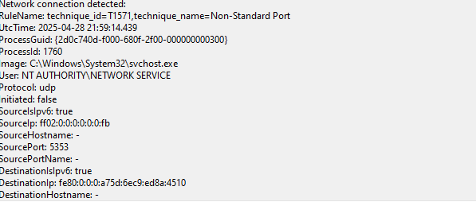

# Blue Team Lab: Detecting Network Scans with Sysmon

## Overview
This project demonstrates a basic blue team detection lab, where a Windows 10 virtual machine is monitored using Sysmon and detects an internal network scan launched from a Kali Linux machine.

The goal is to simulate real-world attacker behavior (reconnaissance) and catch it through endpoint detection and log analysis — core skills for security operations and blue team roles.

---

# Phase 1: Detecting Network Reconnaissance

## Lab Setup

- **Victim Machine**: Windows 10 VM (Internal Network Only)
- **Attacker Machine**: Kali Linux VM (Internal Network Only)
- **Monitoring Tools**: 
  - Sysmon (with a custom detailed configuration)
  - Windows Event Viewer (Sysmon Operational Logs)

---

## Attack Simulation

On the Kali Linux machine, an Nmap SYN scan (`-sS`) was launched against the Windows VM to simulate a basic external reconnaissance attempt.

```bash
nmap -sS <Windows-VM-IP>
```

---

## Detection via Sysmon

The Windows machine was pre-configured with Sysmon and advanced audit policies to capture detailed endpoint activity.

After the scan, multiple **Event ID 3** (Network Connection Detected) events were logged in:

```
Applications and Services Logs → Microsoft → Windows → Sysmon → Operational
```

---

## Detection Details

Sysmon’s custom configuration also mapped some network activity to MITRE ATT&CK techniques.

- **Technique ID**: T1571
- **Technique Name**: Non-Standard Port Communication
- **Protocol**: UDP
- **Process**: svchost.exe (system process receiving the connection)

---



## Lessons Learned

- Endpoint monitoring with Sysmon is highly effective for detecting network scans and lateral movement attempts.
- Custom Sysmon configurations provide critical threat context (e.g., MITRE mappings) beyond basic event logging.
- Network reconnaissance, even over IPv6, can be detected by diligent endpoint monitoring.
- Real-world blue teamers must monitor for both TCP and UDP scans across standard and non-standard ports.

---

## Future Enhancements

- Create automated detection rules to block suspicious IPs after scan detection.
- Forward Sysmon logs into a local Splunk or SIEM instance for centralized monitoring.
- Expand lab to simulate additional attacks (failed login brute force, malware execution, etc.)

---

# Phase 2: Defensive Response — Blocking the Attacker

## Firewall Action Taken

After detecting repeated network scan attempts from the Kali Linux machine (`192.168.20.10`), a custom Windows Firewall rule was created on the victim system to block all inbound connections from the attacker.

### Action Steps:
- Opened **Windows Defender Firewall with Advanced Security**
- Created a **Custom Inbound Rule**
- Applied to traffic from:
  ```
  192.168.20.10
  ```
- Chose to **Block the connection**
- Applied rule to **Domain, Private, and Public** profiles

### Outcome:
- All further network traffic from Kali was successfully blocked
- Further scan attempts resulted in no responses or filtered ports
- Confirmed effective blue team detection and response

---

## Lessons Learned

- Endpoint monitoring with Sysmon is highly effective for detecting network scans and lateral movement attempts.
- Custom Sysmon configurations provide critical threat context (e.g., MITRE ATT&CK mappings) beyond basic event logging.
- Immediate defensive actions, such as firewall blocking, are essential to limit attacker movement.
- Real-world blue teamers must monitor for both TCP and UDP scans across standard and non-standard ports.

---

## Future Enhancements

- Automate defensive responses using alert-triggered scripts.
- Forward Sysmon logs into a local Splunk or SIEM instance for centralized monitoring and alerting.
- Expand lab to simulate additional attacks (failed login brute force, malware execution, etc.)

## Author

---
Joshua Beaton

---
